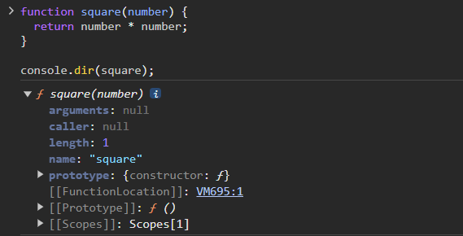
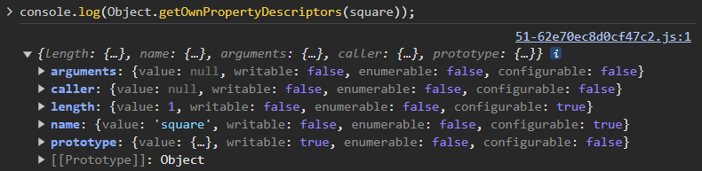
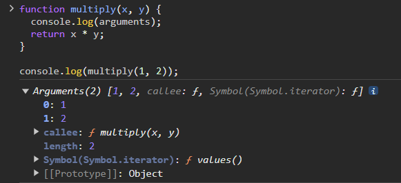

# 📗챕터 정리

<br/>

## 🤔궁금한 점
1. 식별자 네이밍 관련
### 일급 객체의 조건

1. 무명의 리터럴로 생성할 수 있다. (런타임에 생성이 가능하다.)
2. 객체(함수)를 변수에 할당할 수 있다.
3. 객체(함수)를 인자로 전달할 수 있다.
4. 객체(함수)를 값으로 반환할 수 있다.

→ 함수를 객체와 동일하게 사용할 수 있다.

→ 함수 객체는 함수 고유의 프로퍼티를 소유한다.

### 함수 객체의 프로퍼티

함수는 객체이기 때문에 프로퍼티를 가질 수 있다.

`console.dir` 메서드를 사용하여 함수 객체의 내부를 확인할 수 있다.



이후, `Object.getOwnPropertyDescriptors` 메서드를 사용하여 함수의 모든 프로퍼티 속성을 확인할 수 있다.



`argument`, `caller`, `length`, `name`, `prototype` 5개의 프로퍼티 모두 함수 객체의 데이터 프로퍼티이다.

순서대로 어떤 내용을 담고 있는지 확인해보자.

1. `argument`
    
    함수 호출 시 전달된 인수(arguments)들의 정보를 담는다.
    
    `argument`는 순회 가능한 유사 배열 객체 형태이다.
    
    자바스크립트는 매개변수와 인수의 개수가 일치하는지 확인하지 않는다.
    
    때문에 매개변수와 인수의 개수가 서로 일치하지 않더라도 에러가 발생하지 않는다.
    
    동작 원리를 살펴보자면, 선언한 매개변수는 변수와 동일하게 undefined로 초기화된 이후 인수가 할당된다.
    
    매개변수의 개수보다 인수를 적게 전달하여, 인수가 전달되지 않은 매개변수는 undefined가 할당된 채로 함수를 실행하게 된다.
    
    반대로, 매개변수보다 인수를 많이 전달한다면 초과된 인수는 무시된다.
    
    하지만 초과된 인수가 그냥 버려지는 것은 아니며 암묵적으로 `argument` 객체의 프로퍼티로 보관된다.
    
    (`argument`는 유사 배열 객체이기 때문에 내부에 프로퍼티가 존재한다.)
    
    `argument` 객체의 프로퍼티로는 인수 정보(`순서: 값`의 형태), 객체를 생성한 함수를 표시하는 `callee` 프로퍼티, 인수의 개수를 표시하는 `length` 프로퍼티로 구성된다.
    
    
    
    자바스크립트가 인수의 개수를 확인하지 않기 때문에, 개발자가 인수의 개수를 확인하고 함수의 동작을 결정해야 할 때 `argument` 객체를 유용하게 사용할 수 있다.
    
    또한, 매개변수의 개수를 확정할 수 없는 **가변 인자 함수**를 구현할 때도 유용하게 사용된다.
    
    ```jsx
    function sum() {
      let res = 0;
    
      // arguments 객체는 length 프로퍼티가 있는 유사 배열 객체이므로 for 문으로 순회할 수 있다.
      for (let i = 0; i < arguments.length; i++) {
        res += arguments[i];
      }
    
      return res;
    }
    
    console.log(sum());        // 0
    console.log(sum(1, 2));    // 3
    console.log(sum(1, 2, 3)); // 6
    ```
    
    ES6 버전에서는 가변 인자 함수를 편하기 구현할 수 있는 Rest 파라미터가 도입되었다.
    
    ```jsx
    // ES6 이전
    function sum() {
      const array = Array.prototype.slice.call(arguments);
      return array.reduce(function (pre, cur) {
        return pre + cur;
      }, 0);
    }
    
    console.log(sum(1, 2));          // 3
    console.log(sum(1, 2, 3, 4, 5)); // 15
    
    // ES6 Rest parameter
    function sum(...args) {
      return args.reduce((pre, cur) => pre + cur, 0);
    }
    
    console.log(sum(1, 2));          // 3
    console.log(sum(1, 2, 3, 4, 5)); // 15
    ```
    

    **💡 유사 배열 객체**
    배열 형태로 인자 정보를 담고 있지만, 실제로 배열이 아닌 객체를 의미한다.
    유사 배열 객체는 length 프로퍼티를 가지고 있으며, for 반복문으로 순회가 가능하다.
    실제로 배열은 아니기 때문에 배열 메서드를 사용하면 에러가 발생한다.
    
2. `caller`
    
    함수 호출 시, 함수 자신을 호출한 함수를 가리킨다.
    
    ECMAScript 사양에 포함되지 않은 비표준 프로퍼티이다.
    
    브라우저와 Node.js 환경에서 실행 결과가 다르게 출력되는데, 이는 모듈과 관계가 있다.
    
3. `length`
    
    함수를 정의할 때 선언한 **매개변수의 개수**를 가리킨다.
    
    `argument` 객체의 `length` 프로퍼티는 **인자의 개수**를 가리키기 때문에 두 프로퍼티는 차이가 있다.
    
4. `name`
    
    함수 호출 시, 함수 이름을 가리킨다.
    
    만약 함수 이름이 없는 익명 함수라면 함수 객체를 가리키는 변수 이름을 값으로 갖는다.
    
    ```jsx
    let namedFunc = function foo() {};
    console.log(namedFunc.name); // foo
    
    let anonymousFunc = function() {};
    console.log(anonymousFunc.name); // anonymousFunc
    ```
    
5. `prototype`
    
    생성자 함수로 호출할 수 있는 함수 객체만 소유하는 프로퍼티이다.
    
    non-constructor 객체에는 `property` 프로퍼티가 존재하지 않는다.

## 📌중요한 점
💡 argument 프로퍼티