# 📗챕터 정리

## 객체 지향 프로그래밍

프로토타입을 보기 전에 먼저 객체 지향 프로그래밍과 상속 개념이 무엇인지 짚고 넘어가야 한다.

프로그램을 명령어, 함수의 목록으로 보는 명령형(함수형) 프로그래밍의 절차 지향적인 관점에서 벗어나, 여러 개의 독립적 단위인 객체의 집합으로 프로그램을 표현하는 프로그래밍의 패러다임을 의미한다.

필요한 데이터를 추상화하여 특징 및 성질을 가진 객체로 만들고, 객체들의 상호작용을 통해 로직을 구성하게 된다. 객체를 만들 때는 **부품화**와 **재사용성**을 고려하여 만들어야 한다.

객체 지향 프로그래밍에서의 객체는 **상태 데이터(프로퍼티)와 동작(메서드)을 하나의 논리적인 단위로 묶은 복합적인 자료구조**라 할 수 있다.

각 객체는 자신의 고유한 기능을 수행하면서 동시에 다른 객체와의 **관계성**을 갖고 데이터를 주고 받거나, 상속받아 사용하기도 한다.

## 상속

상속이란 객체 지향 프로그래밍에서 가장 중요한 개념이다.
우리가 알고 있는 뜻 그대로, 다른 객체의 정보를 상속 받아서 그대로 사용할 수 있는 것을 의미한다.
자바스크립트의 객체는 상속을 통해 불필요한 중복을 제거한다.

```jsx
// 생성자 함수
function Circle(radius) {
  this.radius = radius;
  this.getArea = function () {
    return Math.PI * this.radius ** 2;
  };
}

// 반지름이 1인 인스턴스 생성
const circle1 = new Circle(1);

// 반지름이 2인 인스턴스 생성
const circle2 = new Circle(2);

// Circle 생성자 함수는 인스턴스를 생성할 때마다 동일한 동작을 하는
// getArea 메서드를 중복 생성하고 모든 인스턴스가 중복 소유한다.
// getArea 메서드는 하나만 생성하여 모든 인스턴스가 공유해서 사용하는 것이 바람직하다.
console.log(circle1.getArea === circle2.getArea); // false

console.log(circle1.getArea()); // 3.141592653589793
console.log(circle2.getArea()); // 12.566370614359172
```

위 예제에서 `Circle` 생성자 함수를 통해 생성된 모든 인스턴스는 자신의 상위 객체인 `Circle` 객체의 모든 프로퍼티와 메서드를 상속 받는다.

---

## 프로토타입(Prototype) 이란

인스턴스가 생성될 때, 인스턴스의 "**원형**"이 되는 상위 객체를 **프로토타입**이라고 한다.
모든 객체는 하나의 프로토타입을 가지고, 모든 프로토타입은 생성자 함수와 연결되어 있다.
따라서, 프로토타입과 생성자 함수는 단독으로 존재할 수 없고 반드시 쌍으로 존재한다.

바로 위 예제에서는 Circle 생성자 함수가 인스턴스들의 프로토타입이 된다.
생성된 인스턴스에서 `__proto__` 접근자 프로퍼티를 통해 자신의 상위(부모) 객체인 **프로토타입에 간접적으로 접근**할 수 있다.
모든 객체는 하나의 프로토타입을 가지고 있으므로, `__proto__` 접근자 프로퍼티를 사용하여 객체의 상위(부모)객체를 호출할 수 있다.

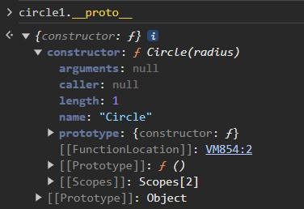

(자바스크립트에서 `[[Prototype]]` 처럼 두 겹의 대괄호로 감싼 것은 모두 내부 슬롯, 내부 메서드이다.
내부 슬롯과 내부 메서드는 원칙적으로 접근이 불가능하며, 호출할 수 있는 방법이 없다.)

접근자 프로퍼티는 다른 객체 프로퍼티에 접근하여 값을 읽거나 저장할 때 사용하는 접근자 함수 `get`, `set`을 가지고 있다.
접근자 프로퍼티를 통해 프로토타입에 접근하면 내부 `get __proto__` 함수가 호출되고,
접근한 프로퍼티에 새로운 프로토타입을 할당하면 `set __proto__` 함수가 호출된다.

```jsx
const obj = {};
const parent = { x: 1 };

// getter 함수인 get __proto__가 호출되어 obj 객체의 프로토타입을 취득
obj.__proto__;
// setter함수인 set __proto__가 호출되어 obj 객체의 프로토타입을 교체
obj.__proto__ = parent;

console.log(obj.x); // 1
```

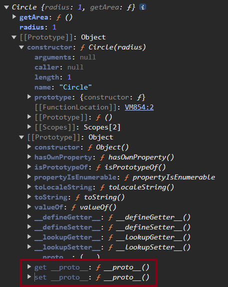

---

## 🔗 `Object.Prototype` 와 프로토타입 체인

자바스크립트 엔진은 객체의 프로퍼티(메서드)에 호출할 때, 해당 객체에 접근하려는 프로퍼티가 없다면 `__proto__` 접근자 프로퍼티가 가리키는 참조를 따라 상위(부모) 객체에 접근한다.
접근한 상위(부모) 객체에서 원래 호출하고자 했던 프로퍼티가 있는지 확인하여 프로퍼티가 존재한다면 프로퍼티를 호출하고, 없다면 다시 상위(부모) 객체에 접근하는 행동을 반복 수행하게 된다.
이것을 **프로토타입 체인**이라고 한다.

프로토타입 체인으로 상위 객체에 접근하다보면 최상위 객체인 `Object.prototype`에 접근하게 된다.
`Object.prototype` 은 모든 객체의 조상 격 객체이며, 모든 객체는 `Object.prototype` 객체의 프로퍼티를 상속 받는다고 할 수 있다.

`__proto__` 접근자 프로퍼티는 생성된 인스턴스가 직접 소유하는 프로퍼티가 아니며, 최상위 객체인 `Object.property` 객체에서 상속 받아 사용한다.
생성한 인스턴스 객체가 직접 소유한 프로퍼티가 아니기 때문에 `hasOwnProperty()` 메서드를 사용하여 `__proto__` 접근자 프로퍼티가 있는지 확인했을 때 `false`를 반환한다.
(`hasOwnProperty()` 메서드는 객체 내에 프로퍼티가 존재하는지 확인하고 그 결과를 반환한다.)
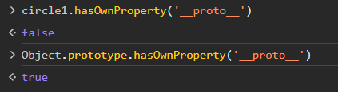

`circle1` 인스턴스 객체에는 `__proto__` 접근자가 존재하지 않는다.
하지만 모든 객체의 최상위 객체인 `Object.prototype`에 `__proto__` 접근자 프로퍼티가 존재하므로 프로토타입 체인을 통해 프로퍼티를 호출할 수 있다.
결론적으로 모든 객체는 상속을 통해 `Object.prototype.__proto__` 접근자 프로퍼티를 상속 받아서 사용할 수 있다.

---

## ⚠️ 프로토타입은 사용하지 말 것

위에서 모든 객체는 하나의 프로토타입을 가지고 있다고 언급하였다.
하지만 개발자가 객체를 만들 때, `Object.prototype` 객체를 상속받지 않는 객체를 생성할 수도 있다.
(추후에 학습할 직접 상속 등의 방법을 통해…)
그렇게 되면 `__proto__` 접근자 프로퍼티를 호출할 수 없게 되어 오류를 야기할 수 있다.
때문에 `__proto__` 접근자 프로퍼티를 직접 사용하는 것은 권장하지 않는다.

그렇다면 프로토타입은 언제 사용하는가?
프로토타입은 단지 프로토타입 체인이 상호 참조 등의 문제 없이 제대로 이루어지는가를 확인하는 용도로 사용하는 것이 옳다.
아래 사진은 문제가 된다고 언급한 상호 참조의 예시이다.

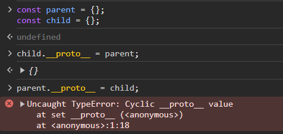

서로가 자신의 상위 객체가 되기 때문에 프로토타입 체인을 통해 프로퍼티를 검색할 때 무한 루프에 빠질 수 있다.
때문에 자바스크립트 엔진은 이러한 상황이 발생할 때 에러를 발생시킨다.
프로토타입 체인은 반드시 단방향으로 이루어져야 하며, 프로토타입 접근자 프로퍼티를 사용하여 이를 확인할 수 있다.

만약 프로토타입 참조를 취득하고 싶은 경우에는 `Object.getPrototypeOf` 메서드를,
프로토타입을 교체하고 싶을 때는 `Object.setPrototypeOf` 메서드를 사용할 것을 권장한다.
이 메서드들은 각각 `get(set) Object.prototype.__proto__` 와 처리 내용이 동일하다.

---

## ⏰ 프로토타입 생성 시점

프로토타입은 생성자 함수가 생성되는 시점에 같이 생성된다.
풀어서 설명하자면 생성자 함수로서 호출할 수 있는 함수인 constructor의 함수 정의가 평가되어 함수 객체를 생성하는 시점에 프로토타입도 더불어 생성된다.

(함수) 함수 호이스팅 파트에서 살펴보았듯 함수 선언문은 런타임 이전에 자바스크립트에 의해 먼저 실행된다.
따라서 함수 선언문으로 정의된 생성자 함수는 런타임 이전에 함수 객체가 되며 프로토타입도 동시에 생성된다.
생성된 프로토타입은 생성자 함수의 `prototype` 프로퍼티에 바인딩되며, 오직 constructor 프로퍼티만 갖는다.

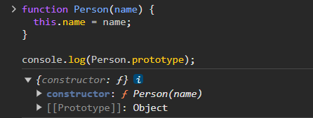

빌트인 생성자 함수(Object, String, Number, …)도 일반 함수와 마찬가지로 빌트인 생성자 함수가 생성되는 시점에 프로토타입이 생성된다.
생성된 프로토타입은 전역 객체가 생성되는 시점에 생성되고, 빌트인 생성자 함수의 `prototype` 프로퍼티에 바인딩된다.
흔히 사용되는 배열의 `forEach`, `sort` 등의 메서드는 빌트인 생성자 함수이자 배열의 최상위 객체인 `Array.prototype` 객체에 존재하는 프로퍼티를 프로토타입 체인을 통해 상속 받아 사용하는 것이다.

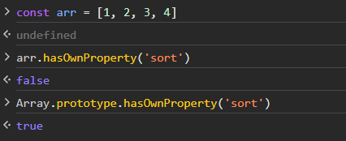

---

## 함수 객체의 prototype 프로퍼티

함수 객체는 일반 객체와 다르게 `prototype` 이라는 프로퍼티를 가지고 있다.
(일반 객체에는 prototype 프로퍼티가 존재하지 않는다.)

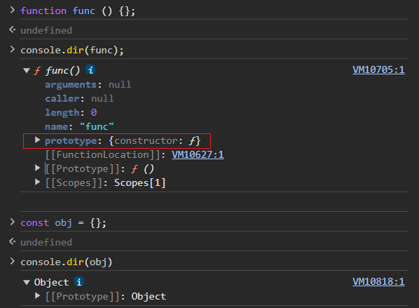

함수 객체가 소유하는 `prototype` 프로퍼티는 생성자 함수 자신의 상위(부모) 객체가 아닌, **자신이 생성할 인스턴스(객체)의 원형**을 의미한다. (함수 객체의 `prototype` ≠ `__proto__`)
함수 객체가 가지는 `prototype` 프로퍼티는 자기 자신을 통해 생성될 하위(자식) 객체의 `__proto__` 접근자 프로퍼티와 동일한 객체를 가리킨다.

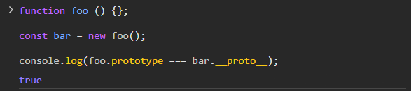

예제에서 생성된 `bar` 객체는 프로토타입인 `foo` 함수 객체의 `constructor`를 통해 생성자 함수와 연결된다.
생성자 함수를 통해 생성된 `bar` 객체는 일반 객체이므로 `constructor` 프로퍼티가 존재하지 않는다.

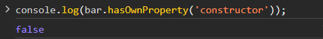

하지만, `bar` 객체는 프로토타입인 `foo` 함수 객체의 constructor 를 상속 받을 수 있으며,
상속 받은 constructor 프로퍼티는 `foo` 함수 객체와 일치한다.

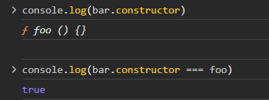

`prototype` 프로퍼티를 가진 함수 객체는 생성자 함수로 인스턴스를 생성할 수 있어야 한다.
즉, constructor 함수여야만 `prototype` 프로퍼티를 가지게 된다.
- 함수 선언문
    
    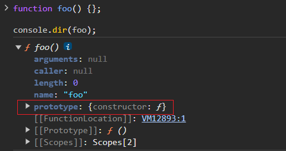
    
- 함수 표현식
    
    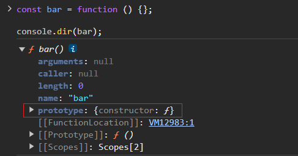
    

생성자 함수로 인스턴스를 생성할 수 없는 non-constructor 함수는 `prototype` 프로퍼티가 존재하지 않는다.
- 화살표 함수
    
    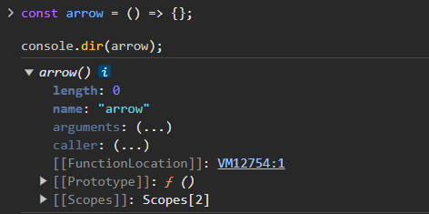
    
- 객체의 메서드
    
    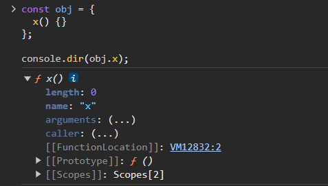

<br />

## 프로토타입 체인을 활용한 프로퍼티 추가, 변경, 삭제

생성자 함수가 생성할 객체에 프로퍼티(메서드)를 추가하고자 한다면 `Person.prototype` 객체에 프로퍼티를 추가해야 한다.
프로퍼티를 추가하게 되면 앞으로 생성자 함수를 사용하여 생성할 객체 뿐만 아니라 이미 만들어져 있는 객체 또한 프로토타입 체인을 통해 추가된 프로퍼티를 사용할 수 있다.

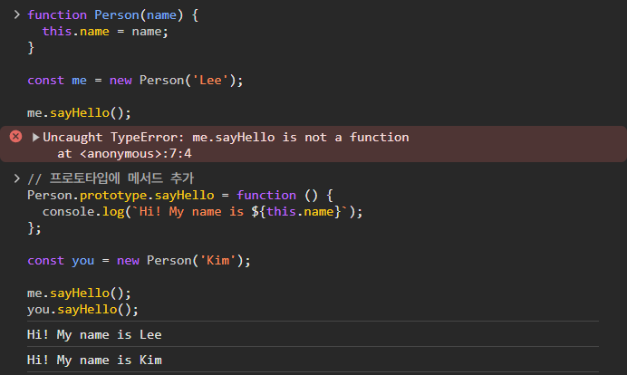

프로토타입 객체에 존재하는 프로퍼티를 변경하고 싶다면 객체를 생성할 때 프로퍼티를 재정의하여 사용할 수도 있다.
프로토타입 프로퍼티와 같은 이름의 프로퍼티를 인스턴스에 추가하면 하위에 있는 인스턴스 객체의 프로퍼티를 호출하게 되는데, 이를 “**오버라이딩(overriding)**”이라고 한다.
상속 관계에서 프로토타입의 프로퍼티가 가려지는 현상은 “프로퍼티 섀도잉(shadowing)”이라고 한다.

```jsx
const Person = (function () {
  // 생성자 함수
  function Person(name) {
    this.name = name;
  }

  // 프로토타입 메서드
  Person.prototype.sayHello = function () {
    console.log(`Hi! My name is ${this.name}`);
  };

  // 생성자 함수를 반환
  return Person;
}());

const me = new Person('Lee');

// 인스턴스 메서드
me.sayHello = function () {
  console.log(`Hey! My name is ${this.name}`);
};

// 인스턴스 메서드가 호출된다. 프로토타입 메서드는 인스턴스 메서드에 의해 가려진다.
me.sayHello(); // Hey! My name is Lee (Hi -> Hey)
```

delete 키워드로 객체의 프로퍼티를 삭제하는 경우도 있다.
위 예제에서 `sayHello` 메서드를 삭제해보자.

```jsx
// 인스턴스 메서드를 삭제한다.
delete me.sayHello;
// 인스턴스에는 sayHello 메서드가 없으므로 프로토타입 메서드가 호출된다.
me.sayHello(); // Hi! My name is Lee
```

프로토타입 메서드가 아닌 인스턴스 메서드인 `sayHello`가 삭제된다.
하위 객체를 통해 프로토타입의 프로퍼티를 변경, 삭제하는 것은 불가능하다.
만약 프로토타입의 프로퍼티를 변경, 삭제하려면 하위 객체를 통해서가 아니라 프로토타입 객체에 직접 접근해야 한다.

❓ 아래에 경우에는 delete 키워드로 sayHello() 메서드를 삭제하면 프로토타입의 메서드가 삭제된다… p.290
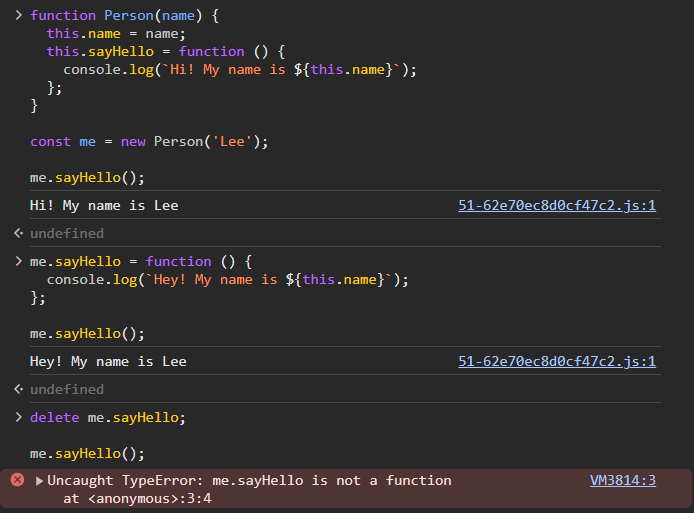

---

## 프로토타입 객체의 교체

프로토타입은 임의의 다른 객체로 변경이 가능하다.

```jsx
const Person = (function () {
  function Person(name) {
    this.name = name;
  }

  // ① 생성자 함수의 prototype 프로퍼티를 통해 프로토타입을 교체
  Person.prototype = {
    sayHello() {
      console.log(`Hi! My name is ${this.name}`);
    }
  };

  return Person;
}());

const me = new Person('Lee');

// 프로토타입을 교체하면 constructor 프로퍼티와 생성자 함수 간의 연결이 파괴된다.
console.log(me.constructor === Person); // false
// 프로토타입 체인을 따라 Object.prototype의 constructor 프로퍼티가 검색된다.
console.log(me.constructor === Object); // true
```

1. 프로토타입을 교체하지 않았을 때 `me` 객체의 프로퍼티
    `new Person()` 코드를 통해 `me`에 할당되는 것은 Person 생성자 함수를 통해 생성된 인스턴스이다.
    생성된 인스턴스인 `me` 객체의 프로토타입은 당연히 생성자 함수 객체이다.
    생성자 함수 객체는 함수 객체이기 때문에 내부에 constructor 프로퍼티가 존재한다.
    
    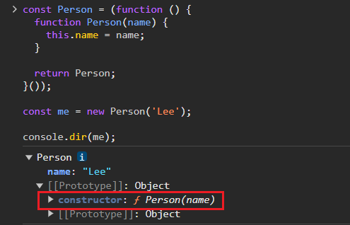
    
2. 프로토타입을 교체했을 때 `me` 객체의 프로퍼티
    
    생성된 인스턴스인 `me` 객체의 프로토타입이 객체 리터럴로 변경된 경우, 프로토타입인 객체 리터럴은 함수 객체가 아니므로 내부에 constructor 프로퍼티가 존재하지 않는다.

    이 때 프로토타입 체인이 발생하면서 더 상위의 프로토타입인 `Object.prototype`에 접근하게 되고, `Object.prototype` 객체에 존재하는 `constructor` 프로퍼티에 접근하게 되면서 `me.constructor`를 호출했을 때 Object 객체가 반환된다.
    
    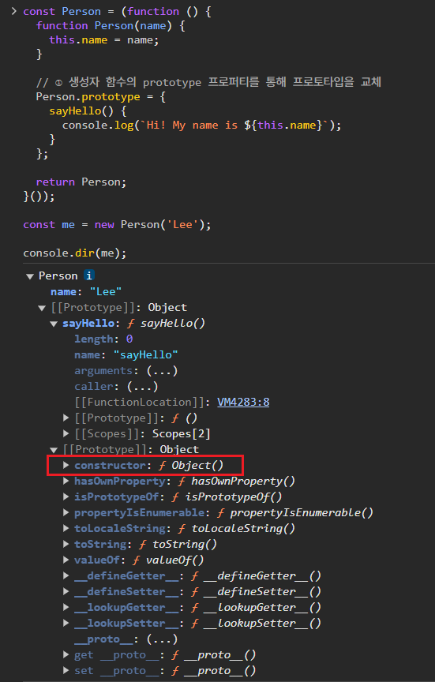
    

프로토타입을 교체해야 하지만 기존 constructor 객체가 필요할 수도 있을 것이다.
이 때는 프로토타입을 교체한 객체 리터럴에 constructor 프로퍼티를 직접 추가하여 프로토타입의 constructor 프로퍼티를 되살릴 수 있다.

```jsx
const Person = (function () {
  function Person(name) {
    this.name = name;
  }

  // 생성자 함수의 prototype 프로퍼티를 통해 프로토타입을 교체
  Person.prototype = {
    // constructor 프로퍼티와 생성자 함수 간의 연결을 설정
    constructor: Person,
    sayHello() {
      console.log(`Hi! My name is ${this.name}`);
    }
  };

  return Person;
}());

const me = new Person('Lee');

// constructor 프로퍼티가 생성자 함수를 가리킨다.
console.log(me.constructor === Person); // true
console.log(me.constructor === Object); // false
```

## 🤔궁금한 점
p.290 프로퍼티 삭제

## 📌중요한 점
